# 😆 Сигилы

Ниже представлены все сигилы разрешённые у нас на сервере, а также их действие и потребление крови.

<table data-full-width="true"><thead><tr><th width="336">Название</th><th width="474">Действие</th><th>Затраты крови(LP)</th></tr></thead><tbody><tr><td>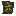Сигил предсказания</td><td><a data-footnote-ref href="#user-content-fn-1">ПКМ </a>по алтарю - показывает уровень алтаря и сколько в нём LP <a data-footnote-ref href="#user-content-fn-2">ПКМ </a>по воздуху - показывает сколько LP в вашей сети</td><td>0</td></tr><tr><td>Водный сигил</td><td>Создаёт источник воды</td><td>100</td></tr><tr><td>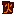Лавовый сигил</td><td>Создаёт источник лавы</td><td>1000</td></tr><tr><td>Сигил зелёной рощи</td><td>Ускоряет рост растений в небольшом от вас радиусе</td><td>150/5 сек</td></tr><tr><td>Воздушный сигил</td><td>Подбрасывает игрока</td><td>50</td></tr><tr><td>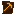Сигил быстрого копания</td><td>Накладывает "Ускорение 2"</td><td>100/10 сек</td></tr><tr><td>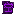Пустотный сигил</td><td>При использовании этот Сигил либо удалит один блок источника жидкости из мира, либо удалит одно ведро жидкости из резервуара</td><td>50</td></tr><tr><td>Сигил плавания</td><td>Даёт эффект "Swimming". Пузырьки воздуха не тратятся и можно быстро копать блоки под водой</td><td>100/10 сек</td></tr><tr><td>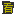Сигил зрения</td><td>Показывает больше информации об алтаре</td><td>0</td></tr><tr><td>Сигил призрачного моста</td><td>Создаёт платформу на высоте игрока. Теперь вам не страшны пропасти, ведь вы можете просто пробежать по ним </td><td>100/10 сек</td></tr><tr><td>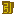Сигил магнетизма</td><td>Притягивает предметы к игроку</td><td>50/10 сек</td></tr><tr><td>Сигил стихийного родства</td><td>Вы не можете умереть сгорев, утонув или упав с высоты </td><td>200/10 сек</td></tr><tr><td>Сигил края</td><td>ПКМ - Открывает сундук Эндера ПКМ+SHIFT - Телепортирует в точку, куда смотрите(тратит каждый раз разное кол-во LP)</td><td>200</td></tr><tr><td>Сигил кровавого светильника</td><td>Создаёт невидимый блок, который освещает территорию</td><td>10</td></tr><tr><td>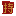Сигил удержания</td><td>Позволяет хранить в себе 5 других сигилов</td><td>0</td></tr><tr><td>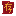Сигил расширенного удержания</td><td>Позволяет хранить в себе 9 других сигилов</td><td>0</td></tr><tr><td>Сигил разрыва края</td><td>Препятствует телепортации</td><td>50</td></tr><tr><td>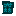Сигил вихря</td><td>Отражает снаряды от игрока</td><td>250</td></tr><tr><td>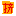Сигил сжатия</td><td>Сжимает ресурсы: самородки->слитки->блоки</td><td>0</td></tr><tr><td>Сигил быстроты</td><td>Увеличение скорости бега и высоты прыжка</td><td>250/10 сек</td></tr><tr><td>Сигил подавления</td><td>Временно убирает жидкости в радиусе 5 блоков от вас</td><td>400/10 сек</td></tr><tr><td>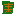Сигил богини плодородия</td><td>Собирает урожай в радиусе 3 блоков от игрока</td><td>500/10 сек</td></tr><tr><td>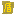Сигил божества</td><td>При активации эта печать обеспечивает чрезвычайно высокий уровень поглощения для игрока</td><td>50 000/10 сек</td></tr></tbody></table>

[^1]: Правая кнопка мыши

[^2]: Правая кнопка мыши
