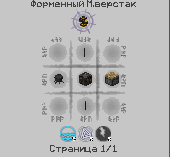

# Наполнение предметов магией

Следующим этапом развития крафтов будет наполнение предметов на рунической матрице. Для её создания нам понадобятся 4 магических камня, 4 магических кирпича, 1магический пьедестал и сама руническая матрица\
.png>).png>).png>)

После того, как мы скрафтили нужные предметы, строим такую конструкцию:

<figure><figcaption></figcaption></figure>

По блоку рунической матрицы щелкаем жезлом с 25 аспектами, после чего матрица преобразится - вы все сделали правильно.&#x20;

<figure><figcaption></figcaption></figure>

У матрицы, есть «параметр» - стабильность. Чтобы её стабилизировать, необходимо расставлять все объекты в ее зоне действия зеркально, а так же окружать черепами мобов/кристальными кластерами/свечами таумкрафта/грибами ботании яйцо дракона. Или использовать стабилизатор матрицы. Так же желательно заменить пол на магический камень.

<figure><figcaption></figcaption></figure>

После её постройки мы можем приступать к крафтам на ней. Для её крафта требуются жидкие аспекты – эссенции, их мы получим в алхимической печи..png>).png>)

<figure><figcaption></figcaption></figure>

Открыв алхимическую печь, у вас появляется ее интерфейс:

<figure><figcaption></figcaption></figure>

1.Буфер эссенции\
2.Слот для топлива\
3.Проццесс плавки\
4.Слот для предметов

Ставим печь, на неё сверху перегонные кубы, в неё складываем уголь, как топливо, в верхний слот – предметы, которые необходимо плавить на эссенции аспектов. Со временем печь, будет выдавать полученные эссенции в перегонные кубы, собираем их от туда банками.

.png>)

Так же эссенцию можно разделить на ее составляющие при помощи алхимической центрифуги и труб для эссенции\
.png>)

Снизу у алхимической центрифуги вход сверху выход, ставим как на картинке. \
Таким образом мы можем получить все первоначальные аспекты, например из Fabrico.

<figure><figcaption></figcaption></figure>

После этого, нам необходимо выложить нужные предметы на пьедесталы вокруг матрицы, и выставить банки с эссенциями там же. Щелкнуть <mark style="color:red;">**пкм**</mark> по матрице жезлом, и следить, чтобы нестабильность не&#x20;

&#x20;                                       <mark style="color:yellow;">**Поздравляю! Вы научились наполнять предметы магией!**</mark>
